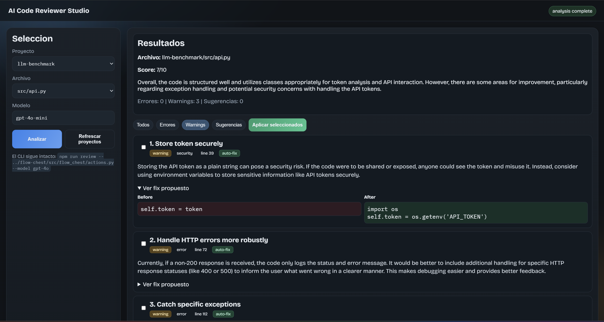

# AI Code Reviewer

Reviewer de codigo con IA orientado a aprender y mejorar rapido:
- analiza archivos reales con GitHub Models
- devuelve feedback estructurado para devs jr
- permite aplicar fixes sugeridos con backup automatico
- incluye CLI interactivo y SPA visual



## Que puede hacer

1. Analizar un archivo y devolver:
- score de calidad
- resumen general
- issues por severidad (`error`, `warning`, `suggestion`)
- explicaciones educativas (que esta mal y por que importa)

2. Sugerir fixes aplicables automaticamente:
- cada issue puede traer `originalCode` + `fixedCode`
- seleccionas cuales aplicar
- crea backup `.bak` antes de modificar

3. Modo CLI:
- review directo por archivo
- seleccion interactiva de proyecto/archivo cuando no pasas ruta
- generacion opcional de reporte HTML (`--report`)

4. Modo SPA visual:
- selector de proyecto y archivo
- analisis en UI
- filtros por severidad
- aplicar fixes seleccionados desde la web

## Requisitos

- Node.js 20+
- npm
- Token de GitHub con permiso `models:read`

## Instalacion

1. Instalar dependencias:

```bash
npm install
```

2. Crear variables de entorno:

```bash
cp .env.example .env
```

3. Editar `.env` y completar al menos:

```env
GITHUB_TOKEN=ghp_tu_token
MODEL=gpt-4o
```

Notas:
- `GITHUB_TOKEN` es obligatorio
- `MODEL` es opcional para el CLI (si no, usa `gpt-4o-mini` por defecto)

## Uso CLI

### 1) Revisar archivo especifico

```bash
npm run review -- ../flow-chest/src/flow_chest/actions.py --model gpt-4o
```

### 2) Modo interactivo (sin pasar archivo)

```bash
npm run review
```

Te pide:
1. proyecto
2. archivo
3. luego muestra issues y permite seleccionar fixes

### 3) Dry run (sin escribir cambios)

```bash
npm run review -- sample.js --dry-run
```

### 4) Reporte HTML visual

```bash
npm run review -- ../food-label-lab-spa/app.js --report
```

Genera un archivo al lado del codigo, por ejemplo:

```text
../food-label-lab-spa/app.js.review.html
```

## Uso SPA (visual)

1. Levantar servidor web:

```bash
npm run web
```

2. Abrir en navegador:

```text
http://localhost:3399
```

3. Flujo en la UI:
1. Seleccionar proyecto
2. Seleccionar archivo
3. Elegir modelo
4. Click en Analizar
5. Marcar fixes
6. Click en Aplicar seleccionados

## Endpoints de la SPA/API

- `GET /api/health`
- `GET /api/projects`
- `GET /api/files?projectPath=...`
- `POST /api/review`
- `POST /api/apply`

## Estructura del proyecto

```text
ai-code-reviewer/
	src/
		index.ts       # CLI
		reviewer.ts    # Llamada al modelo + function calling
		applier.ts     # Aplicacion de fixes + backups
		browser.ts     # Descubrimiento de proyectos/archivos
		reporter.ts    # Generacion de reporte HTML
		server.ts      # API local + servidor SPA
	web/
		index.html
		styles.css
		app.js
	sample.js
	.env.example
```

## Seguridad y limites

- Solo aplica fixes que traen `originalCode` y `fixedCode`
- Si el snippet no matchea, ese fix se salta
- Se crea backup `.bak` antes de escribir cambios
- La calidad depende del modelo y del contexto del archivo

## Troubleshooting rapido

1. Error de token:
- verificar `GITHUB_TOKEN` en `.env`

2. Modelo no disponible:
- probar con `gpt-4o-mini` o `gpt-4o`

3. No encuentra proyectos en modo interactivo:
- ejecutar desde la carpeta del repo `ai-code-reviewer`

4. La SPA no levanta:
- confirmar que el puerto `3399` este libre
- volver a correr `npm run web`

## Comandos utiles

```bash
# ayuda del CLI
npm run review -- --help

# revisar archivo real
npm run review -- ../flow-chest/src/flow_chest/actions.py --model gpt-4o

# levantar SPA
npm run web
```